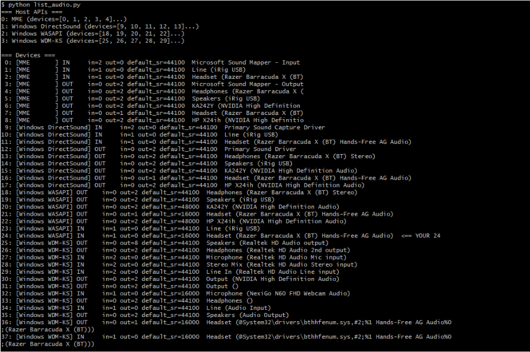

Speaking -> transcribed sentence -> database upload 

iPhone airpod speaker? -> 

When I simply say a sentence in Russian -> some AI model gives the Russian transcription and the English translation. We should then be given the option to upload the sentence to a database. 

Flow would look something like this?

Scratchwork (original)  

Human -> russian sentence -> headset -> program picks up russian sentence -> AI API call (ChatGPT [not free]) -> receive Chatgpt output -> program then takes output and parses for the russian transcription and english translation -> program asks user if want to insert into database -> EZ way to learn russian while gaming

This is good… but im BROKE

There really isn’t a way to use the high end LLM’s without paying for the API calls. 

Unless…

We can locally 

After some more reserach, we need both an LLM and ASR
LLM’s and ASR’s serve different functions

LLM’s are the way AI is able to produce semantics and meaning from text
ASR is speech to text recognition. This is the main part of what we want

ASR is how we go from Я вчера ходил в магазин.
LLM is how we translate that to ‘I went to the store yesterday’.

Workflow

Install an ASR and an LLM locally on my machine

	Using python 3.13.3 and latest pip, we can run
pip install git+https://github.com/openai/whisper.git

	Testing the russian audio file transcribes perfectly. 
	
We then grab audio input with a test program.

We can write a simple script that grabs all audio systems, uses your current mic, and then records a sample of your voice to then shortly playback. 

We now combine the audio input test program with whisper to transform audio into text.
	
	After some testing, i’ve decided on the large whisper model since it is only 2.4 gbs. Need to really speak clearly in order for a clear transcription. Another issue is that the program takes complete control of the audio device resulting in not being to hear anything else on the computer. I will try to look for a workaround later for that. Audio device is also selected by looking up the list of the audio devices currently detected and looking for the desired index of the audio device you are currently using. 

Install the LLM.
	
	We can Ollama for this. We can install Ollama and then run the following LLM
	ollama run qwen2.5:7b
	Must have python 3.10+ 
	
	We can then test this on a sample program which worked perfectly fine. We then need to combine both AIs together: the LLM and the ASR.

Connect the pipeline 

Fix the issue of program taking over the entire audio device.

First lets try input stream settings. After changing parameters, still doens’t work. Seems like bluetooth device cannot be opened through the WDM-KS backend that PortAudio is choosing. 

Let’s try to stop using WDM-KS (Windows Driver Model/Kernel Streaming). 

We can maybe use WASAPI, MME, etc.

PortAudio picks a host API under the hood. Lets force portaudio to use WASAPI/MME

We can’t directly tell sounddevice to use WASAPI. We need to look in InputStream parameters and find the device index that belongs to the WASAPI host API. 

We can run a script that loads all sound devices and their respective APIs

After running script we find out that 

Index 24 is already on windows WASAPI, but its more about the device itself than anything. 
Bluetooth hands-free microphone profile are known for forcing windows into “call mode” audio routing, being fragile with portAudio/driver negotiation. 

Okay turns out I just had to use the other audio device…

